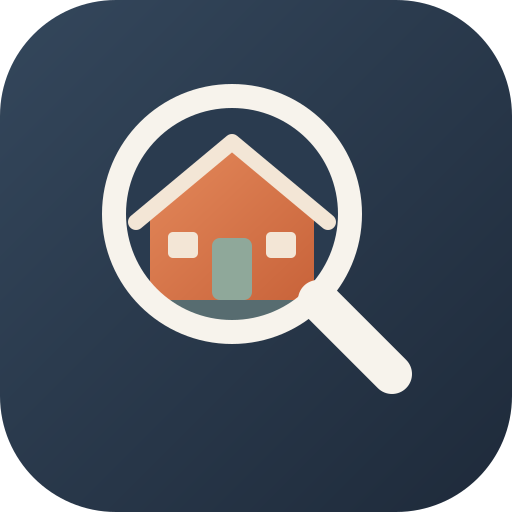

<h1 align="center">Toc-Toc</h1>

<i>powered by Mikasolution</i> <b>Chaque maison a une histoire. Frappez, entrez.</b>

  👉 <a href="https://illynetwork-blip.github.io/Toc-Toc/"><b>Ouvrir l'application</b></a>

---

**La carte de l'agent immobilier**, sur ordinateur, tablette et téléphone.

**Accès protégé** : un mot de passe est demandé à l'ouverture. Sans lui, la page ne contient qu'un texte chiffré (AES-256), illisible même dans le code source. Vos données (biens, acquéreurs, pige, notes) restent **sur votre appareil**.

## Ce que fait Toc-Toc

- **Diagnostic d'un lieu**
  - Parcelle cadastrale et surface, zone du PLU, servitudes (ABF…) et risques.
  - Bâtiment et DPE.
  - Raccordements : eau, gaz, fibre, électricité ; puits et nappe phréatique.
  - Commodités à pied et temps de trajet.
- **Prospection**
  - Passoires thermiques F et G.
  - Fonds de commerce (BODACC), toutes les agences immobilières, commerces.
  - Copropriétés, friches.
  - **Boîtes aux lettres par secteur** et **tournée de boîtage**.
  - **Porte-à-porte guidé par GPS** avec **suivi de pige**.
- **Historique des ventes**
  - Ventes notariées (DVF), prix au m² par secteur, évolution et carte des prix.
  - Résidences principales et secondaires, propriétaires et locataires (INSEE).
- **Mes biens et mes acquéreurs**
  - Mandats avec adresse, étage, n° d'appartement, lot et propriétaire.
  - Rapprochement automatique avec les acquéreurs, agenda et export vers votre calendrier.
- **Outils**
  - Estimation et avis de valeur, frais de notaire, honoraires (net vendeur ⇄ FAI), crédit, rentabilité locative.
  - Mesure, carnet de visite, QR code.
  - **Cartes anciennes et loupe du temps**, zone gardée **hors ligne**, français et anglais.

## Installer sur le téléphone

Ouvrez le lien ci-dessus, puis :
- **Android** : menu **Installer l'application**.
- **iPhone** : **Partager** puis **Sur l'écran d'accueil**.

---

© Toc-Toc · Mikasolution — tous droits réservés. Données publiques : IGN, DGFiP, ADEME, INSEE, Géorisques, Hub'Eau, BODACC, Sirene, ANAH, Cerema, OpenStreetMap.
